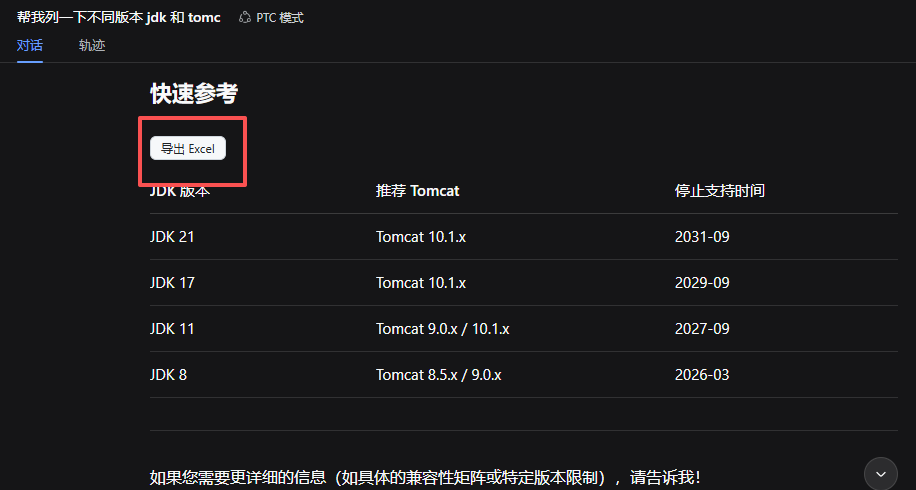

# dsh-md-table-export

DeepSeek Harness（`dsh`）插件：把对话内容里的 **Markdown 表格** 一键导出为 **Excel（`.xlsx`）**。



> 需求来源：对 deepseek-harness web 的对话内容中 markdown table 格式内容增加 Excel 导出功能。

本仓库同时交付两部分，覆盖“模型侧”和“界面侧”两条路径：

| 部分 | 形态 | 作用 |
| --- | --- | --- |
| `src/index.ts` → Node 半 | Cordis 插件（bundle patch） | 向 agent 注册 `export_md_tables_to_excel` 工具，让模型能主动把对话里的表格写成 Excel 文件。 |
| `src/client.ts` → 浏览器半 | dsh Web 客户端 bundle（`dsh.client.platform: "web"`） | 在 dsh Web 对话页的每个渲染后的表格上挂“导出 Excel”按钮，并在右下角提供“导出全部表格”。 |

---

## 为什么能“一个包、两端生效”

较新版本的 deepseek-harness 提供了 **客户端模块系统**（`ctx.clientModules`，见主仓库
`docs/subsystems/client-modules.zh.md`）：宿主扫描所有声明了
`dsh.client`（`platform: 'web'`）并导出 `exports["./client"]` bundle 的包，
把它们组合进浏览器启动图（`window.__DSH_BOOT__`），经 `/plugins/<id>/client.js`
路由把 bundle 送进浏览器执行。因此：

- 无需 Tampermonkey 等用户脚本管理器；
- 无需 fork 主仓库或参与 web-app from-source 构建；
- 一个 npm 包同时声明 Node 半与浏览器半，`plugin --profile web add .` 即可两端生效。

浏览器 bundle 采用官方“惰性 CJS 闭包工厂”契约：脚本执行时只调用
`window.__ModuleLoader__.load({id, factory})` 注册工厂；副作用位于工厂闭包内，
待 shell 物化时运行。构建由 `scripts/wrap-client.mjs` 按
`packages/client/tsdown.client.ts` 的 banner/intro/footer 契约包装 tsc 产物。

---

## 目录结构

```
dsh-md-table-export/
├── package.json                 # dsh.bundle.patch + dsh.client(platform: web)
├── cordis.patch.yml             # bundle 层贡献的配置行（Node 半插件注册）
├── scripts/wrap-client.mjs      # 构建后处理：包装客户端闭包工厂外壳
├── tsconfig.json                # strict + NodeNext
├── vitest.config.ts
├── README.md
├── src/
│   ├── index.ts                 # 插件四导出规范：name / inject / Config / apply（Node 半）
│   ├── client.ts                # 浏览器半模块体（编译+包装为 lib/client.js）
│   ├── tool.ts                  # defineTool 注册 export_md_tables_to_excel
│   ├── parse-markdown-tables.ts # 纯函数：从文本解析 Markdown 表格
│   └── export-excel.ts          # 纯函数：表格 -> .xlsx（基于 xlsx）
└── test/
    ├── parse-markdown-tables.test.ts
    └── export-excel.test.ts
```

---

## 一、安装（Node 半 + 浏览器半一次完成）

```bash
# 1. 安装依赖
npm install

# 2. 类型检查 + 单元测试（质量门）
npm run typecheck
npm test

# 3. 构建（tsc 编译 lib/ + 包装客户端闭包工厂外壳）
npm run build

# 4. 把当前插件加入 web profile（同时作为 bundle 层进入配置树）
npx @deepseek-ai/dsh plugin --profile web add .

# 5. 重启 dsh web 进程，刷新浏览器页面
```

安装后效果：

- **浏览器半**：dsh Web 对话页每个渲染出的 Markdown 表格上方出现 **“导出 Excel”**
  按钮；右下角出现 **“导出全部表格为 Excel”** 浮动按钮（每表一 sheet）。
- **Node 半**：对话中让模型调用 `export_md_tables_to_excel` 工具导出文件。

> 注意：插件集合的变更在宿主重启后生效（客户端模块系统按名缓存包元数据）；
> 若只改了 bundle 内容，开发环境经 HMR 的 `rebuilt()` 到达图。

### 工具参数

| 参数 | 类型 | 必填 | 说明 |
| --- | --- | --- | --- |
| `markdown` | string | ✅ | 包含一个或多个 pipe 表格的 Markdown / 文本。 |
| `outputDir` | string | | 写出目录；缺省用插件 `defaultOutputDir` 或进程 cwd。 |
| `fileName` | string | | 文件名（不含扩展名），默认 `markdown-tables`。 |
| `sheetPerTable` | boolean | | `true` 时每个表格单独一个 worksheet；否则堆叠进同一个 `Tables` 表。 |

### 配置（overlay / cordis.yml）

```yaml
- id: dsh-md-table-export
  name: dsh-md-table-export
  config:
    defaultOutputDir: "/tmp/dsh-exports"
    sheetPerTable: false
```

> 注意：patch 是按 `id` 整体替换 `config`（非深合并），overlay 需写全字段。

---

## 二、客户端 bundle 的工作方式

1. `npm run build`：tsc 把 `src/client.ts` 编译为 `lib/client.js`（纯模块体，无 import/export），
   `scripts/wrap-client.mjs` 剥掉 tsc 追加的 `export {}` 并套上官方闭包工厂外壳：
   `window.__ModuleLoader__.load({ id, factory })`。
2. 宿主（Node 半）的 `ctx.clientModules` 扫描到本包 `dsh.client.platform === 'web'`
   与 `exports["./client"]`，把 bundle 内容哈希为 rev、写入浏览器启动图，并经
   `/plugins/<id>/client.js` 路由提供文件。
3. 浏览器 shell 解析 `window.__DSH_BOOT__` 启动图，加载本包 bundle 并物化工厂，
   读取返回的 `{ name, inject: [], apply }` 组装 fiber；`apply()` 在 DOM 就绪后
   挂 MutationObserver 扫描 `<table>` 注入按钮。
4. SheetJS 通过 CDN 动态注入（首次点击导出时按需加载），导出全程在浏览器本地完成。

---

## 三、核心逻辑说明

- **解析**（`parse-markdown-tables.ts`）：识别 GitHub 风格表格的经典两行结构——表头行（含 `|`）+ 对齐行（仅 `-`、`:`、空格、管道）。随后逐行读取数据行，自动对齐列宽（短行补空、长行截断），支持转义管道 `\|`、代码围栏内表格、多表共存。
- **导出**（`export-excel.ts`）：基于 `xlsx`，单表时堆叠进 `Tables` 表（表间空一行），或按 `sheetPerTable` 每表一 sheet；自动创建输出目录，文件名做 Excel 工作表名合法性清洗。
- 主机工具与 Web 脚本**共用同一套“Markdown 表格”语义**，保证两边导出的内容一致。

---

## 四、Model Experience（模型可见行为）

当对话中出现表格、用户要求“导出 / 下载 / 存成 Excel”时，模型应调用 `export_md_tables_to_excel`，传入对话中的原始 Markdown（含表格的文本）。工具返回写出文件的绝对路径，并以文本卡片告知用户“已导出 N 个表格到 <path>”。

---

## 五、Known Limitations（已知限制）

- 主机工具的 `markdown` 需由调用方提供原文；它不会主动去“读”当前 web 界面。浏览器侧的导出按钮负责界面交互，两者通过“同一份表格内容”自然衔接。
- 解析器按行识别表格，不处理跨行合并单元格（Markdown 表格本身无 rowspan/colspan 语义）。
- 客户端 bundle 依赖 dsh Web 把表格渲染为 `<table>`；若某自定义渲染器改用 div 网格，需相应调整选择器。
- 主机半的 `xlsx` 依赖经 npm 安装；浏览器 bundle 的 SheetJS 经 CDN 动态注入（内网无法访问 CDN 时不可用）。
- 客户端模块系统要求较新的 deepseek-harness 版本（存在 `ctx.clientModules` 服务与 `dsh.client` 包声明扫描）。

---

## 六、质量门（与本地文档一致）

| 检查项 | 命令 |
| --- | --- |
| 类型安全 | `npm run typecheck`（`strict`，无 any 逃逸） |
| 单元测试 | `npm test`（vitest，覆盖解析与导出） |
| 构建 + 外壳包装 | `npm run build`（tsc → wrap-client.mjs，`node --check lib/client.js` 可验语法） |
| 组合验证 | `dsh --profile web --dump-config` |
| HMR 安全 | Node 半注册全部包在 `ctx.effect()` 内；bundle 内容变更经 `rebuilt()` 到达图 |

---

## License

MIT
